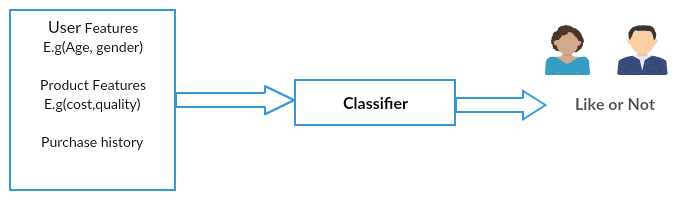

# Post-Recommender-System
**A recommendation system is an extensive class of web applications that involves predicting the user responses to the options.** A recommendation system has been a hot topic for a long time.

They are simple algorithms which aim to provide the most relevant and accurate items to the user by filtering useful stuff from of a huge pool of information base. Recommendation engines discovers data patterns in the data set by learning consumers choices and produces the outcomes that co-relates to their needs and interests.

In Real time examples are like Amazon, they have been using a recommendation engine for suggesting the goods or products that customers might also like.

**More about Recommendation System Here :- https://en.wikipedia.org/wiki/Recommender_system**
## How to Design Recommendation System ??

Although machine learning (ML) is commonly used in building recommendation systems, it doesn’t mean it’s the only solution. There are many ways to build a recommendation system? simpler approaches, for example, we may have very few data, or we may want to build a minimal solution fast etc.

Assume that, for simpler video recommendation,In such that case, based on videos a user has watched, we can simply suggest same authors videos or same publications videos.
* popularity based
* classification based
* collaborative filtering

### Popularity based:

Easiest way to build a recommendation system is popularity based, simply over all the products that are popular, So how to identify popular products, which could be identified by which are all the products that are bought most,
Example, In shopping store we can suggest popular dresses by purchase count.

### Classification Based:

Second way to build a recommendation system is classification model , In that use feature of both users as well as products in order to predict whether this product liked or not by the user.
When new users come, our classifier will give a binary value of that product liked by this user or not, In such a way that we can recommend a product to the user .

In above example using user features like Age, gender and product features like cost, quality and product history, based on this input our classifier will give a binary value user may like or not , based on that boolean we could recommend product to a customer.
